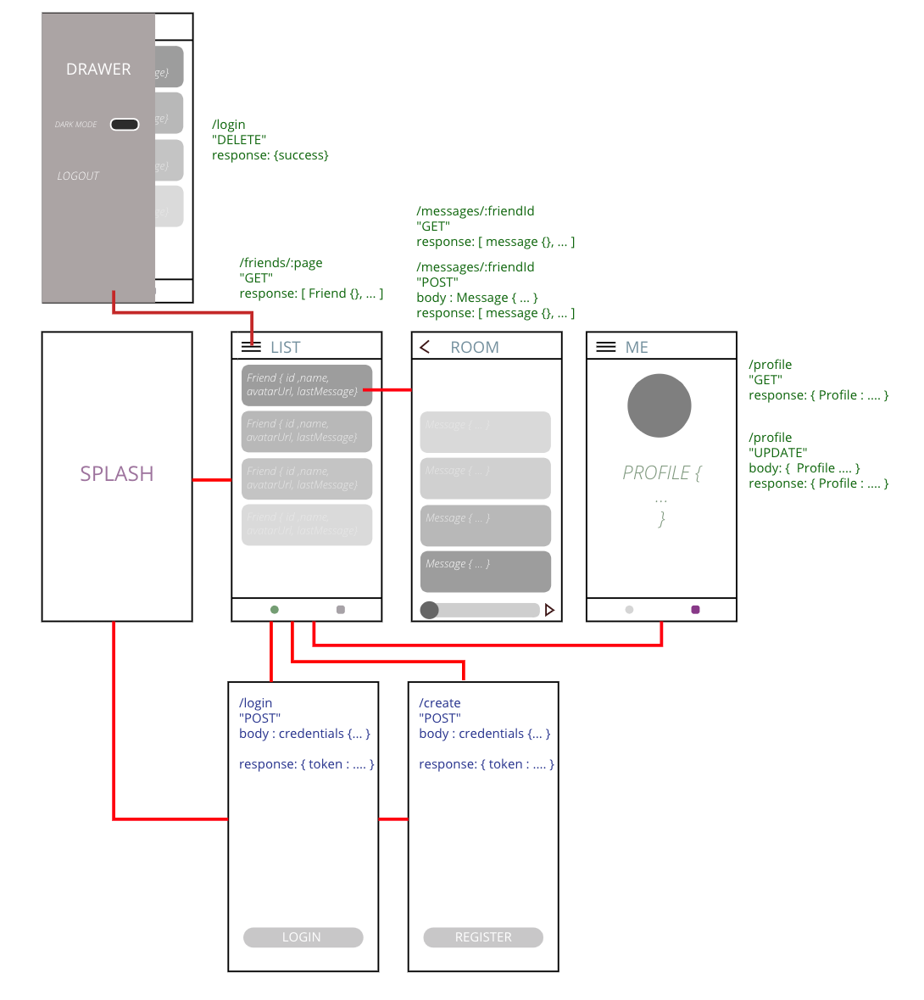

## Welcome to Holmusk Mobile Engineering challenge

You are just assigned to a new (exciting) app!
It's a simple chat app that let user communicate their friends via media message. 

### Scenario

A (wild) **PROJECT MANAGER** appear with a set requirements and wireframes !

Requirements:
* User can Login or Create account to use app features.
* User can view and edit their profile.
* User can refresh their profile.
* User can see and refresh list of their friends.
* User can see and refresh message from their friend inside a chat room.
* User can send text and image (camera and photo library).
* User can refresh message list.
* User can access menu from top left button.
* User can toggle app to dark / light mode.
* User can logout and clear all data.

### Wirefame

Then you turn to your watchful protector, the silent knight, the **BACKEND ENGINEER** to get his/her (not so) wise counsel. Alas, his/her hands are also tied with other things right now, but they can promise you these: 

* Host: com.simple.chat, scheme: https, port: 433
* Document-type: json
* 200 -> response success and return corresponding data
* 400 -> bad request parameters (shame on you).
* 401 -> sessions expired (user must re login to use the app)
* 404 -> endpoints not found (are you lost?)
* 500 -> Internal server errors (it's just a glitch)

> Ignore how user get friends, just assume it's magically populated already.

> Endpoints in BLUE means non secure endpoint.

> Endpoints in GREEN means secure endpoint - token must be provided in request headers.

### Objectives 

* You are expected to design a skeleton app  in a well structured, robust, modular and testable way.

* This is a mock app, you can cut corner on UI layer.
> Ignore the form in login and create page, a button to trigger the action will do.
> No need to build custom view or widget, just print it to a Text is okay. etc.

* You are expected to test / mock all the api communication to server, so app can seamlessly integrated with live server when it's ready.

* Fell free to use whatever (mobile) platform or libraries you are comfortable with.

###  Bonus point:

* Mock a Deep link from push-notification delegate/callback feature.
(payload: friendId, deep link to chatroom page)

* Logging mechanism at development or production level.

* Dynamic app theme.

* Dynamic app environment (local, staging, production)

* Live connection in chat room.

If you have questions, now it's time to shoot them before you start your journey!
Message me directly @ daniel.tjuatja@holmusk.com.
Or you can take **initiative** and **improvise** along the way!

